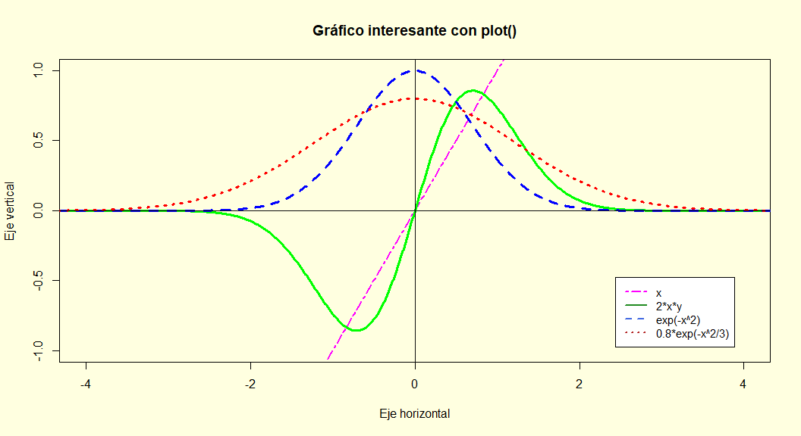
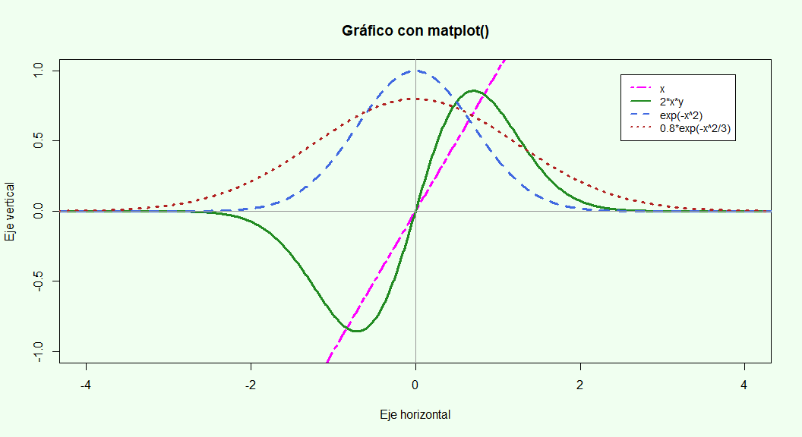
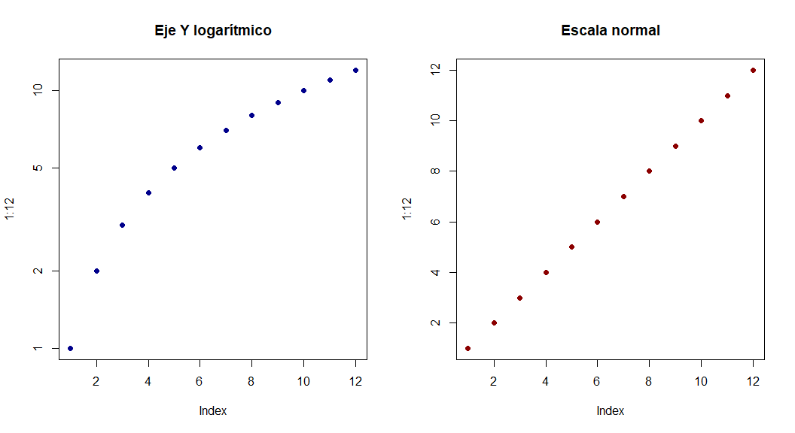
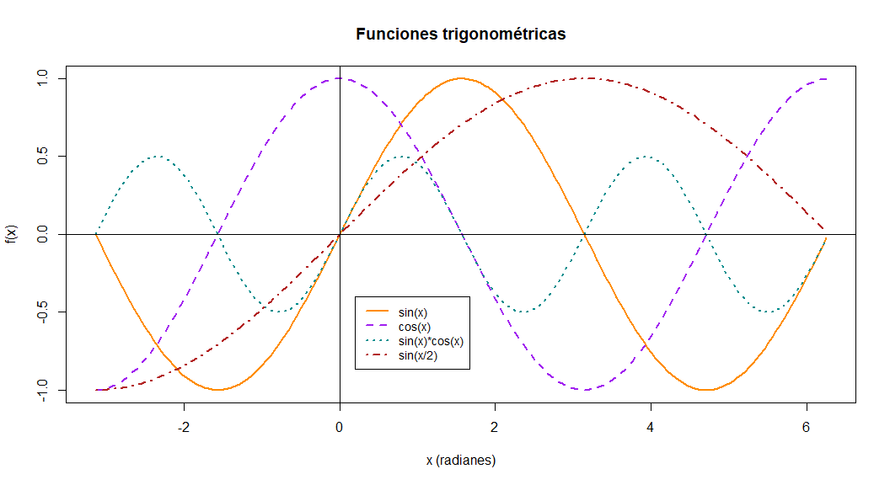

``` r
title: "Gráficas con plot() y matplot() en R"
author: "Doctor Víctor Cruz"
date: "30 mar. 2026"
output:
  html_document:
    keep_md: true
    toc: true
    toc_float: true
    theme: flatly
    code_folding: hide
    df_print: paged
highlight: tango
editor_options: 
  chunk_output_type: console
```


``` r
knitr::opts_chunk$set(
  echo = TRUE, message = FALSE, warning = FALSE,
  fig.align = "center", fig.width = 11, fig.height = 6 )
# setwd("G:/Mi unidad/_2026 NUBE/_Metodos Numericos/_Metodo Grafico/Final plot y mplot")
```

### Definición de datos y funciones

En esta sección creamos el **eje x** y tres series a graficar. - `x` para el eje horizontal. - `y = exp(-x^2)` (campana gaussiana). - `w = 0.8 * exp(-x^2/3)` (gaussiana más ancha y de menor amplitud). - También graficaremos la recta `x` y el producto `2*x*y` para contraste.


``` r
x <- seq(-5, 5, by = 0.01)
y <- exp(-x^2)
w <- 0.8 * exp(-x^2/3)
```

### Paleta y tipos de línea


``` r
colores <- c("magenta", "forestgreen", "royalblue", "firebrick")
tipos   <- c(6, 1, 2, 3)  # 6=twodash, 1=solid, 2=dashed, 3=dotted
etqs    <- c("x", "2*x*y", "exp(-x^2)", "0.8*exp(-x^2/3)")
```

------------------------------------------------------------------------

### Enfoque base: `plot()` + `lines()`

Este es el enfoque “paso a paso”: primero una curva base con `plot()`, luego vamos **superponiendo** el resto con `lines()`.


``` r
# Guardamos y restauramos parámetros gráficos para no afectar otros gráficos

op <- par(no.readonly = TRUE); on.exit(par(op), add = TRUE)

par(pty = "m", bg = "lightyellow")  # pty="s": región de trazado cuadrada

# Gráfico base (la primera serie)
plot(x, x, 
     col = 'magenta', type = 'l', lwd = 2, lty = 6,
     xlim = c(-4, 4), ylim = c(-1, 1), 
     xlab = 'Eje horizontal', 
     ylab = 'Eje vertical', 
     main = 'Gráfico interesante con plot()' )

abline(h = 0, v = 0, col = "gray60") 

# Añadimos las líneas adicionales

lines(x, 2 * x * y, col = 'green', type = 'l', lwd = 3, lty = 1)
lines(x, y, col = 'blue', type = 'l', lwd = 3, lty = 2)
lines(x, w, col = 'red', lwd = 3, lty = 3)

# Ejes de referencia

abline(h = 0, v = 0, col = "gray5")


legend(
  "bottomright", inset = 0.05,
  legend = etqs, col = colores, lty = tipos, lwd = 2, cex = 0.95,
  bg = "white"
)
```



> Expone explícitamente el orden de capas (base + líneas), muestra parámetros clave y permite explicar cada elemento con claridad.

------------------------------------------------------------------------

### Enfoque compacto: `matplot()` (menos código, mismo resultado)

`matplot()` dibuja **todas las columnas** de una matriz contra `x`. Evita escribir múltiples `lines()`.


``` r
op <- par(no.readonly = TRUE); on.exit(par(op), add = TRUE)

par(pty = "m", bg = "honeydew")

# Matriz con las 4 series como columnas

M <- cbind(x, 2*x*y, y, w) # agregamos 2xy

matplot(
  x, M, type = "l", 
  col = colores, lwd = 3, lty = tipos,
  xlim = c(-4, 4), ylim = c(-1, 1),
  xlab = "Eje horizontal", ylab = "Eje vertical",
  main = "Gráfico con matplot()"
)

abline(h = 0, v = 0, col = "gray60")

legend(
  "topright", inset = 0.05,
  legend = etqs, col = colores, lty = tipos, lwd = 2, cex = 0.9,
  bg = "white"
)
```



> **Nota:** Incluir `x` como **primera columna** de `M` hace que `matplot(x, M, ...)` pinte la **recta y=x** como una de las series. Si no quiere esa recta, use `M <- cbind(2*x*y, y, w)`.

------------------------------------------------------------------------

### Panel rápido de comparación (normal vs. log)

Ejemplo breve de **panel 1×2** y eje logarítmico en `y`:


``` r
op <- par(no.readonly = TRUE); on.exit(par(op), add = TRUE)

par(mfrow = c(1, 2), pty = "m")

plot(1:12, log = "y", main = "Eje Y logarítmico", col = "darkblue", pch = 16)
plot(1:12, main = "Escala normal", col = "darkred", pch = 16)
```



------------------------------------------------------------------------

### Ejemplo : 4 funciones trigonométricas con `matplot()`

Comparemos `sin(x)`, `cos(x)`, `sin(x)*cos(x)` y `sin(x/2)`.


``` r
#op <- par(no.readonly = TRUE); on.exit(par(op), add = TRUE)
#par(pty = "m", bg = "honeydew")

x2 <- seq(-pi, 2*pi, by = 0.05)
f1 <- sin(x2)
f2 <- cos(x2)
f3 <- sin(x2)*cos(x2)
f4 <- sin(x2/2)

M2 <- cbind(f1, f2, f3, f4)

cols2 <- c("darkorange", "purple", "cyan4", "firebrick")
ltys2 <- c(1, 2, 3, 4)

matplot(
  x2, M2, type = "l",
  lwd = 2, lty = ltys2, col = cols2,
  main = "Funciones trigonométricas",
  xlab = "x (radianes)", ylab = "f(x)"
)
abline(h = 0, v = 0, col = "black", lty = 1)

legend( x = 0.2, y = -0.4, inset = 0.05,
        legend = c("sin(x)", "cos(x)",
                   "sin(x)*cos(x)", "sin(x/2)"), 
        col = cols2, 
        lty = ltys2, lwd = 2, cex = 0.9, bg = "white" )
```



------------------------------------------------------------------------

### Otras formas de posicionar la leyenda:

Si las palabras clave no te dan la precisión que necesitas, puedes usar estas alternativas:

1.  Usando coordenadas (x, y): En lugar de una palabra clave, puedes pasar los valores exactos de los ejes x e y donde quieres que empiece la esquina superior izquierda de la caja de la leyend

```R
# La leyenda empezará en el punto x=2, y=5 del gráfico
legend(x = 2, y = 5, legend = c("A", "B"))
```

### Las 9 posiciones clave principales:

-   **`"bottomright"`**: Abajo a la derecha (la que mencionaste).

-   **`"bottom"`**: Abajo en el centro.

-   **`"bottomleft"`**: Abajo a la izquierda.

-   **`"left"`**: A la izquierda, centrada verticalmente.

-   **`"topleft"`**: Arriba a la izquierda.

-   **`"top"`**: Arriba en el centro.

-   **`"topright"`**: Arriba a la derecha.

-   **`"right"`**: A la derecha, centrada verticalmente.

-   **`"center"`**: Exactamente en el centro del gráfico.

### Colores

varios ejemplos de grises más oscuros que `gray60`:

-   **`col = "gray50"`** (Gris medio)

-   **`col = "gray40"`**

-   **`col = "gray30"`**

-   **`col = "gray20"`**

-   **`col = "gray10"`** (Gris muy oscuro, casi negro)

-   **`col = "gray0"`** (Equivalente a `"black"`)

Puedes usar cualquier número entero entre 0 y 60 para obtener un tono más oscuro que `gray60` (por ejemplo, `"gray45"`, `"gray22"`, etc.).

### Códigos Hexadecimales RGB (16,777,216 colores)

Si usas el formato hexadecimal estándar de la web que combina Rojo, Verde y Azul (RGB), el límite es de $256 \times 256 \times 256$.

Esto te da **16,777,216 colores posibles**. El formato debe ser un string que comience con el símbolo de gato/almohadilla `#` seguido de 6 caracteres.

-   **Ejemplos:** `col = "#FF0000"` (rojo puro), `col = "#000000"` (negro),

    `col = "#4682B4"` (azul acero).

### Notas finales

-   Documento **auto-contenido** con base R; no requiere paquetes adicionales más allá de `rmarkdown`/`knitr` para renderizar.
-   Use el botón **Knit** en RStudio y elija **HTML** para reproducir las figuras.
