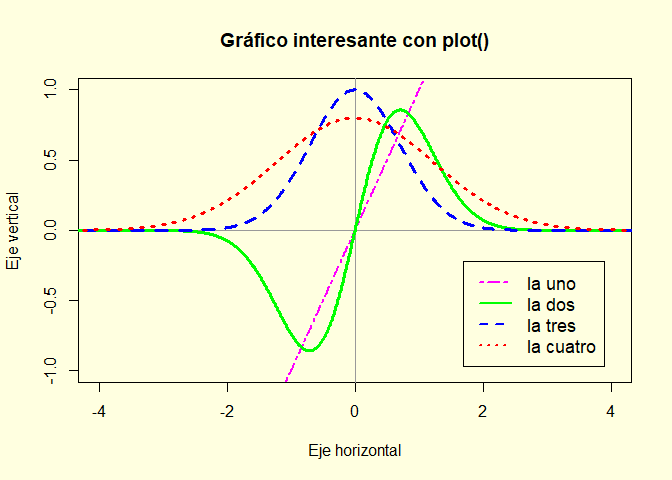
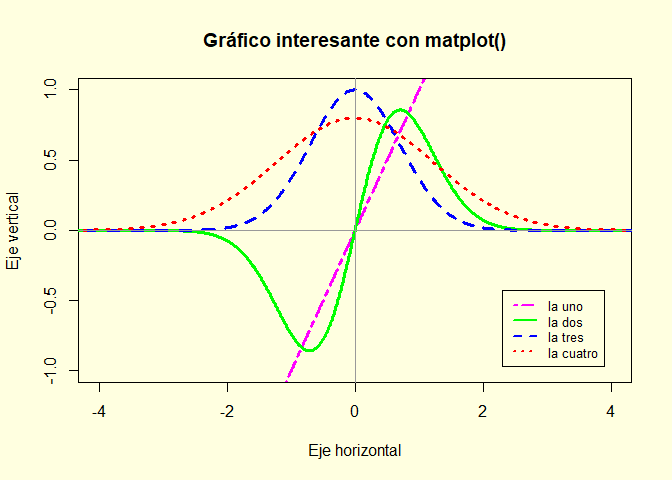
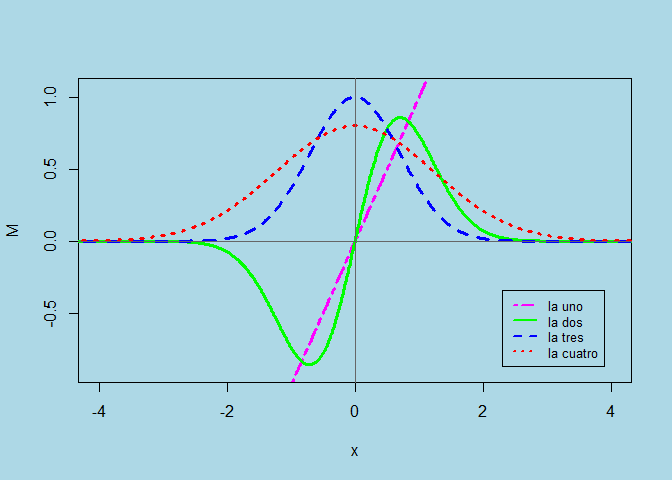

``` r
knitr::opts_chunk$set(
echo = TRUE,
warning = FALSE,
message = FALSE,
fig.align = 'center')
#. setwd("G:/Mi unidad/_2026 NUBE/metodos26")
```

``` R
title: "Función Plot y matplot"
author: "Dr. Víctor Cruz"
date: "30 mar. 2026"
output: 
  html_document:
    keep_md: true
    df_print: paged
    toc: true
    number_sections: true
    toc_float:
      collapsed: true
      smooth_scroll: true
    code_folding: hide
    css: styles.css
    self_contained: true
    highlight: tango
editor_options: 
  chunk_output_type: console
```

## Cálculo de variables

Primero, definimos las variables y funciones matemáticas que vamos a graficar.


``` r
x <- seq(-5, 5, 0.01)
y <- exp(-x^2)
w <- 0.8 * exp(-x^2/3)
```

## Gráfica con la función plot

A continuación, creamos el gráfico utilizando la función base plot y añadiendo las líneas una por una con la función lines

## Configuración del área de trazado

(cuadrada y con fondo amarillo claro)


``` r
# par(bg = 'white')

par(pty = "m", bg = 'lightyellow') # Capa base

plot(x, x, 
     col = 'magenta', type = 'l', lwd = 2, lty = 6,
     xlim = c(-4, 4), ylim = c(-1, 1), 
     xlab = 'Eje horizontal', 
     ylab = 'Eje vertical', 
     main = 'Gráfico interesante con plot()' )

abline(h = 0, v = 0, col = "gray60") 

# Añadimos las líneas adicionales

lines(x, 2 * x * y, col = 'green', type = 'l', lwd = 3, lty = 1)

lines(x, y, col = 'blue', type = 'l', lwd = 3, lty = 2)

lines(x, w, col = 'red', lwd = 3, lty = 3)

# Añadimos la leyenda

legend("bottomright", inset = 0.05, 
       legend = c('la uno', 'la dos', 'la tres', 'la cuatro'),
       lty = c(6, 1, 2, 3),
       lwd = 2,
       col = c('magenta', 'green', 'blue', 'red'),
       cex = 1.1)
```




``` r
par(pty = "m", bg = 'lightyellow')

# Unimos los vectores en una matriz como columnas
M <- cbind(x, 2*x*y, y, w)

# matplot dibuja todas las columnas contra 'x' automáticamente

#matplot(x, M)

matplot(x, M,
        col = c('magenta', 'green', 'blue', 'red'), 
        type = 'l',
        lwd = 3,
        lty = c(6, 1, 2, 3),
        xlim = c(-4, 4),
        ylim = c(-1, 1),
        xlab = 'Eje horizontal',
        ylab = 'Eje vertical',
        main = 'Gráfico interesante con matplot()')

# EJES

abline(h = 0, v = 0, col = "gray60")

# Leyenda

legend("bottomright", inset = 0.05,
       legend = c('la uno', 'la dos', 'la tres', 'la cuatro'),
       lty = c(6, 1, 2, 3), 
       lwd = 2,
       col = c('magenta', 'green', 'blue', 'red'),
       cex = .8)
```




``` r
par(pty = "m", bg = 'lightblue')

# Unimos los vectores en una matriz como columnas
M <- cbind(x, 2*x*y, y, w)

# matplot dibuja todas las columnas contra 'x' automáticamente

#matplot(x, M)

matplot(x, M,
        col = c('magenta', 'green', 'blue', 'red'), 
        type = 'l',
        xlim = c(-4, 4),
        ylim = c(-0.9, 1.05),
        lwd = 3,
        lty = c(6, 1, 2, 3))

# EJES

abline(h = 0, v = 0, col = "gray40")

# Leyenda

legend("bottomright", inset = 0.05,
       legend = c('la uno', 'la dos', 'la tres', 'la cuatro'),
       lty = c(6, 1, 2, 3), 
       lwd = 2,
       col = c('magenta', 'green', 'blue', 'red'),
       cex = .8)
```


